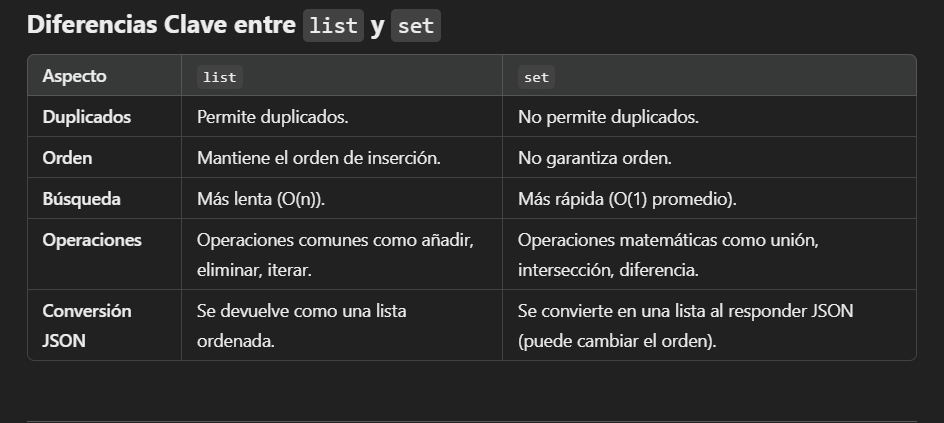

Cometando documentació ***body-fields*** con postman.

He puesto la siguiente put con la siguiente url 

Despues de ello me dirijo al body , selecciono la opcion Json y me aparece el texto, para que pueda funcionar, debo escribir la informacion que hay en el SWWAGER O escribirla yo directamente.
Como podemos comprobar con el POSTMAN , el codigo funciona.

***Body-Nested Models***
He realizado una prueba con el list : 

Como podemos observar, he añadido el id numero 100 y podemos ver que al ejecutarlo funciona correctamente

El resultado que me devuelve es el siguiente : 

Tambien he realizado una prueba con set con la misma informacion :

Como podemos observar en la siguiente imagen, el  parte del set, al introducir dos valores que son similares, me elima uno y se queda solo con uno, pero funciona correctamente.

A continuacion procederemos a realizar la coneccion con la base de datos: 
captura de que se conecto a la base de datos : 

foto de la creacion de la base de datos en pgAdmi: 

**INSERTANDO USUARIO**

A continuacion introduzco la siguinete infomracion : 

Me devuelve la lista Json conforme se ma ha insertado correctamente el usuario : 

Procedemos a la verifica en pgAdmi que se haya insertado correctamente :

A continuacion lo que hago es el read. esto signfica que voy a buscar al usuario mediante su id, si este id existe me lo devolvera: 

Se ha incertado correctamente.

diferencia entre usar el set y list 

